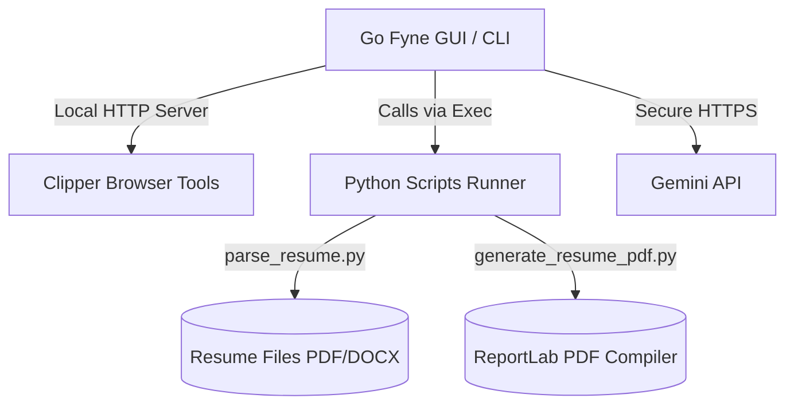

# 📎 LeGaJ — Let's Get a Job

[](https://go.dev)
[](https://python.org)
[](https://fyne.io)

LeGaJ (Let's Get a Job) is a modern, offline-first job search suite. It integrates a **Go + Fyne GUI/CLI desktop interface** with a **Python scripts runner** for parsing resume files, tailoring bullet points via the Gemini API, compiling single-page PDF resumes/cover letters, and tracking job applications locally.

Designed with accessibility in mind, LeGaJ guides fresh graduates through the recruitment lifecycle with a user-friendly GUI while offering a full-featured CLI for advanced users and scripts.

---

## 🚀 Key Features

* **Onboarding Setup Wizard** – Step-by-step GUI setup for Gemini API configurations, workspace paths, and base resume import on the first launch.
* **Local Resume Parser** – Extracts data from PDF, DOCX, TXT, and Markdown files into a standardized profile JSON structure.
* **AI Resume Tailoring** – Synthesizes your profile against job descriptions, dynamically rewriting bullet points and reordering skills to highlight relevant keywords.
* **Print-Ready PDF Compiler** – Uses ReportLab to generate professional, single-page, print-ready PDF documents adhering to strict geometry constraints.
* **Local Job Tracker** – Tracks applications locally (`job-tracker.json`) with editable status, notes, and one-click tailoring of resumes and cover letters for selected jobs.
* **One-Click Browser Clipper** – Saves job postings from LinkedIn, Indeed, Greenhouse, Lever, Workday, Ashby, and iCIMS straight into your **Job Leads** inbox.

---

## 🛠️ Architecture & Tech Stack

LeGaJ operates on a hybrid desktop frontend and a Python-powered document processing backend:



### Stack Components
* **Frontend Shell**: Built with Go using [Fyne v2](https://fyne.io) for cross-platform visual widgets.
* **Core Scripts**:
  - `parse_resume.py`: Extracts and parses resume elements (uses `pypdf`, `python-docx`).
  - `generate_resume_pdf.py` / `generate_cover_letter_pdf.py`: Compiles high-fidelity single-page documents (uses `reportlab`).
  - `manage_applications.py`: Local database controller for application tracking.

---

## 📦 Installation & Setup

### Prerequisites
1. **Python 3.12+** – Must be installed and added to your system's PATH.
2. **Go 1.25+** – Required if you are compiling from source.

### Run Instructions

#### Option A: One-Click Setup (Recommended for Windows)
Simply double-click the [setup_and_run.bat](setup_and_run.bat) file. This script will automatically:
1. Detect your Python environment.
2. Upgrade `pip` and install all required libraries from `requirements.txt`.
3. Launch the LeGaJ GUI dashboard.

#### Option B: Manual Terminal Setup
1. Install Python dependencies:
   ```powershell
   pip install -r requirements.txt
   ```
2. Initialize directories and setup configuration:
   ```powershell
   ./legaj.exe wizard
   ```
3. Run the graphical user interface:
   ```powershell
   ./legaj.exe
   ```

#### Option C: macOS (from Source)

> **New to the Mac terminal?** Open **Terminal** by pressing `Cmd + Space`, typing `Terminal`, and hitting Enter. All commands below are pasted and run there.

**Quick install (recommended):** The setup script checks for every dependency, installs anything missing via [Homebrew](https://brew.sh), and launches the app automatically.

```bash
git clone https://github.com/bot-bbio/legaj.git
cd legaj
chmod +x install_mac.sh && ./install_mac.sh
```

The script will walk you through anything that needs a manual step (e.g. the Xcode CLT install dialog). Re-run it after each prompt and it will pick up where it left off.

---

**Manual install** — if you prefer to do each step yourself:

**1. Xcode Command Line Tools**

The Fyne UI framework uses `cgo`, which requires Apple's C compiler and system frameworks. Run:
```bash
xcode-select --install
```
Follow the on-screen prompt. This also installs `git`. You can skip this step if you have already installed Xcode or the CLT before.

**2. Go 1.25+**

Download the macOS `.pkg` installer from [go.dev/dl](https://go.dev/dl/) and run it, or use [Homebrew](https://brew.sh):
```bash
brew install go
```
Verify the install: `go version` must print `go1.25` or higher.

**3. Python 3.12+**

Download the macOS installer from [python.org/downloads](https://www.python.org/downloads/) and run it, or use Homebrew:
```bash
brew install python@3.12
```
Verify the install: `python3 --version` must print `Python 3.12.x` or higher.

**4. Clone the repository**
```bash
git clone https://github.com/bot-bbio/legaj.git
cd legaj
```

**5. Install Python dependencies**

All Python packages used by the scripts are pinned in `requirements.txt`:
```bash
pip3 install -r requirements.txt
```

This installs the following libraries (and their transitive dependencies):

| Package | Used for |
| :--- | :--- |
| `reportlab` | Generating PDF resumes and cover letters |
| `pypdf` | Parsing PDF resume files |
| `python-docx` | Parsing Word (.docx) resume files |
| `requests` | HTTP calls in the job search tool |
| `beautifulsoup4` | Parsing job board HTML in the job search tool |
| `genanki` | Creating Anki flashcard decks for interview prep |
| `openpyxl` | Spreadsheet export |

**6. Run LeGaJ**
```bash
go run .
```
Go will automatically download its own module dependencies (`fyne` and others listed in `go.mod`) on first run. Or build a persistent binary first:
```bash
go build -o legaj
./legaj
```

> **First launch:** The setup wizard runs automatically on first start. You can also trigger it explicitly:
> ```bash
> go run . wizard
> ```
>
> **Data location:** LeGaJ writes your profile, job tracker, and generated PDFs to `~/Library/Application Support/LeGaJ/`. This directory is created automatically on first launch.
>
> **Gemini API key:** Required for AI resume tailoring. Enter it in the **Settings** tab during setup.

---

## 🖥️ Graphical User Interface (GUI) Guide

LeGaJ divides its functions into seven main views available from the header navigation bar:

1. **Dashboard** – High-level summary of your active job applications, success ratios, and clipper listener status.
2. **Job Hunt** – Review listings clipped from your browser in the *Job Leads* inbox and add the ones you want to your tracker.
3. **Base Profile** – Interactive form to manage your master details, experiences, and education stored in `references/user-profile.json`.
4. **Job Tracker** – Table displaying job statuses (`Wishlist`, `Applied`, `Interviewing`, `Offer`, `Rejected`, `Ghosted`). Select applications and use **Tailor Selected** to generate print-ready resume and/or cover letter PDFs.
5. **File Manager** – Browse, open, and rename assets in your local outputs and workspace paths directly from the app.
6. **Settings** – Configure your Gemini API key, model, and target output folder.
7. **Help** – Collapsible guides, bookmarklet installers, Chrome extension loading tips, and security disclosures.

---

## 💻 CLI Usage Reference

For automation or command-line workflows, LeGaJ provides a robust set of CLI commands:

| Command | Arguments / Flags | Description |
| :--- | :--- | :--- |
| `wizard` | *None* | Force-launches the onboarding configuration wizard. |
| `parse-resume` | `-resume <path>` `[-output <path>]` | Parses a resume PDF/DOCX into unstructured text and exports a base JSON profile skeleton. |
| `tailor-resume` | `[-base <path>]` `[-tailored <path>]` | Computes and displays a difference report between your base profile and a tailored profile JSON. |
| `design-resume` | `[-profile <path>]` `[-output <path>]` | Compiles profile JSON data into a print-ready PDF resume. |
| `write-cover-letter` | `-company <name> -draft <path/text>` `[-output <path>]` | Formats and compiles a cover letter PDF using profile details and a raw text draft. |
| `manage-apps` | `<action> [flags]` | Manages the local job tracker. Actions: `list`, `add`, `update`. |

### CLI Example: Tailoring and Compiling
```powershell
# 1. Parse your resume to initialize base profile skeleton
./legaj.exe parse-resume -resume my_resume.pdf -output references/user-profile.json

# 2. Compile base profile into a PDF resume
./legaj.exe design-resume -profile references/user-profile.json -output outputs/My_Base_Resume.pdf

# 3. Add a new application to the tracker
./legaj.exe manage-apps add -company "Google" -role "Product Manager" -location "Remote" -link "https://careers.google.com/..."
```

---

## 📎 The Browser Clipper System

LeGaJ runs a local HTTP listener on the port set in your settings. You can send jobs to it from your browser:

### 1. The Bookmarklet
Copy the bookmarklet script from the **Help** tab, create a new browser bookmark, and paste the code as the URL. Tap it on any job posting page to add it instantly to your Job Leads inbox.

### 2. Chrome/Edge Extension
For sites with strict Content Security Policies that block external scripts, use our local unpacked extension:
1. Navigate to `chrome://extensions` or `edge://extensions`.
2. Turn on **Developer mode** (top-right).
3. Click **Load unpacked** (top-left) and select the `extension` directory in your LeGaJ installation.
4. Pin the **LeGaJ Clipper** icon to clip listings.

---

## 🔒 Security & Privacy Guardrails

1. **No Auto-Submit** – LeGaJ does not submit applications automatically. You review and send all files yourself.
2. **Local-First Storage** – Your personal data, resumes, credentials, and job logs never leave your disk.
3. **Direct Keys** – Gemini API requests are made directly to Google; no server proxy sits in between.
